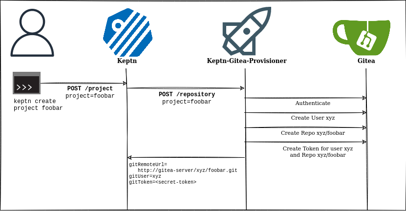

# Architecture

Keptn-Gitea-Provisioner-Service is a microservice with a simple job: When a Keptn project without an upstream is created, it creates a git repo and a token on a (remote) Gitea installation, and return the Git Remote URL, username and token, e.g.:

```
POST /repository
  project=foobar

{
    "gitRemoteUrl": "http://gitea-server:3000/xyz/foobar.git",
    "gitUser": "xyz",
    "gitToken": "<secret-token>"
}
```

See [Keptn API: Repository - addInstance](https://keptn.sh/api/#/repository/addInstance) for more information.

In addition, Keptn-Gitea-Provisioner-Service is also responsible for deleting the upstream repository in Gitea when a Keptn project with an automatic provisioned upstream is deleted.


## Diagram



